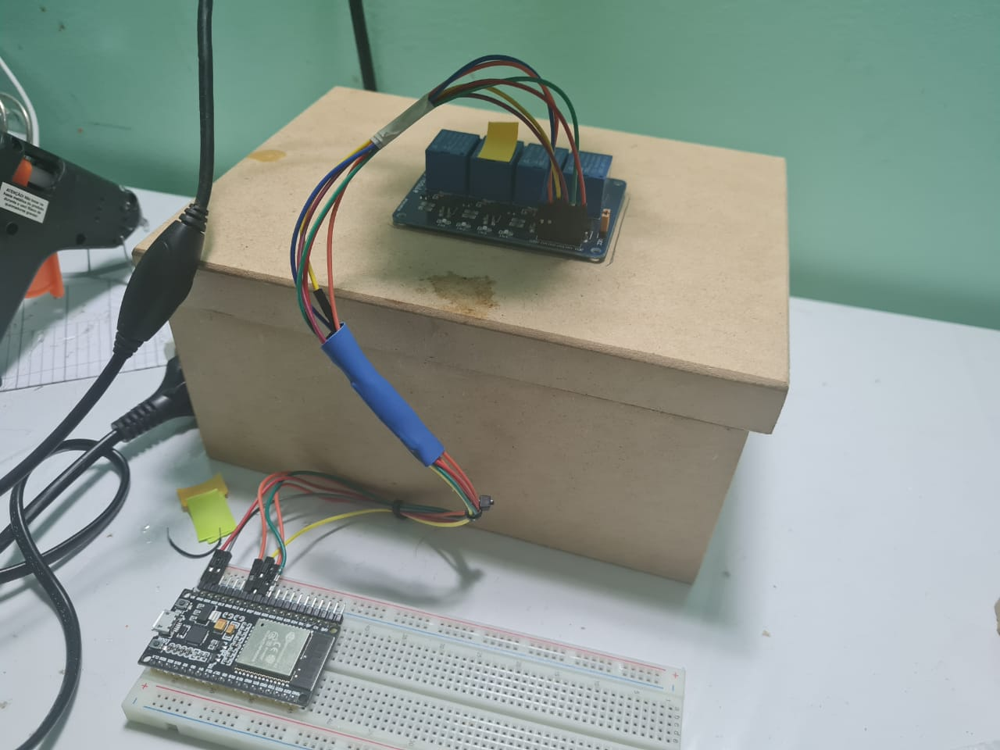
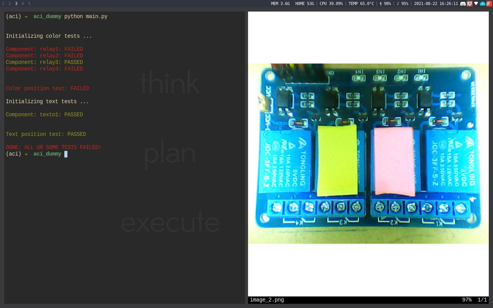
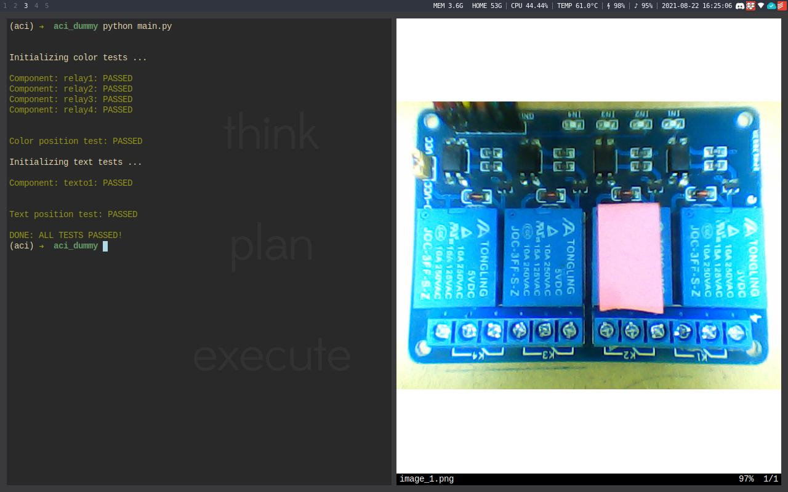

# ACI - Automated Component Inspection - Hakintec 4.0

*Result from the team AIJR on the hackatoon: Hakintec 4.0 in august of 2020. A
simple computer vision system to perform basic visual quality assessment of a
circuit board based.*

Resultado da equipe AIJR no hacktoon: Hakintec 4.0 em agosto de 2020. Um sistema
de visão computacional simples para fazer verificações visuais de qualidade em
placas de circuito.

A ideia para o POC foi a de criar uma plataforma onde fosse possível colocar
uma placa e apertar um botão que enviaria um sinal via MQTT para o computador
que a partir disso iria controlar a câmera (usando OpenCV) via um software em
Python para realizar as seguintes análises:

- Cor do componente (Com checagens via numpy)
- Ativação do LED (Com checagens via numpy)
- Detecção do texto (via o OCR pytesseract)

No entanto houveram problemas no desenvolvimento da comunicação via MQTT. E por
fim usamos um esquema "dummy" (codígo na pasta `aci_dummy`) para a
apresentação, ou seja, sem a inteligência que seria provida pelo MQTT. Portanto
foram passadas apenas as imagens diretamente para o script python printar a
saída. Sem botão de ativação, ou testagem automatizada dos LEDs.

Apesar disso o código do POC teve sucesso em fazer as três checagens nas
imagens coletadas previamente e a montagem ficou totalmente funcional:

Ao ser executado numa imagem com a montagem diferente da dada como referência
o script dá uma saída do tipo:

Neste teste foi verificada a cor dos componentes (relês), e o texto em cima de
um dos relês pra ver se batia com a referência codificada no script.

Com a montagem batendo com a referência dada:

